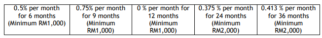

*Photo by Denis Linine from [Pexels](https://www.pexels.com/photo/mountain-ranges-covered-in-snow-714258/)* 

*Post originally appeared in [Money Monies](https://moneymonies.business.blog/2020/05/09/how-to-clear-credit-card-debt-quick/)*

---

It was a casual conversation. Under her relaxed demeanor, I would never have assumed that she currently has RM 40k in credit card debt. While she makes a 5-figure income monthly, with her high monthly commitment, she can only afford the minimum monthly payment of her credit card bill.

It has been an ongoing situation for a while, but the accruing interest made her jitter. Her employer seemed to be in a pinch, given the recent economic situation. Her salary was delayed, and on one particular month, it was paid out a month later. With the delayed salary and hence deferred payment, her credit score had been deteriorating, and she still had to support her family. She wasn't sure what she could do.

<iframe src="https://giphy.com/embed/a6zGGyjGKq7GE" width="675" height="455.625" frameBorder="0" class="giphy-embed" allowFullScreen></iframe>

In this post, I will share with you some of the steps you can take to get out of the shit hole called credit card debt as soon as possible.

Ignoring your debt will not make it disappear. Credit card debt is like a time bomb, and you are racing against time. You need to take drastic actions, fast.

Here are 9 ways how you can get out of RM 40k of credit card debt, divided into 2 levels: beginner aand pro.

*For the pro level, please do not undertake them without doing adequate research. You have been warned. This post is meant to act as a guide to the tools available and is by no means financial advice.* 

## Beginner: Does Not Involve Debt Management Tools

<iframe src="https://giphy.com/embed/3oz8xVl22dHERKjnz2" width="675" height="475.3125" frameBorder="0" class="giphy-embed" allowFullScreen></iframe>

### 1. Cut Your Expenses

If you have been keeping track of your expenses, great! Look at your historical expenses and identify where you can trim the fat. Separate them into two categories, fixed costs, and variable costs. Fixed costs are anything that has a **contractual** (black & white) arrangement, such as rent, internet plans, car loans, student loans, etc. You can:

* Cancel any subscription plan you have
* Go for prepaid phone plan instead of postpaid
* Downgrade your internet and insurance plan (temporarily)
* Cut down entertainment expenses
* Get rid of every non-essential spending, i.e. no clothes, no games till you get out of the shit hole of credit card debt! 
* Reduce your eat-out frequency and cook (I recommend the lentil meals, otherwise chicken curry works too) 

*Additional tips*: In some cases, you may be able to negotiate with your landlord to temporarily reduce your rent. Remember, in life, **you get what you negotiate for.** It doesn't hurt to try. 

### 2. Make More Money

Assess your skill sets, and monetize them. 

<iframe src="https://giphy.com/embed/ADgfsbHcS62Jy" width="675" height="414.84375" frameBorder="0" class="giphy-embed" allowFullScreen></iframe>

You can sign up to become a freelancer, and common freelancing skills are copywriting, digital marketing, web design, app development, graphic design, etc. 

Some sites you can consider (only included those that are free to join): 

* [Fiverr](https://www.fiverr.com/)
* [99Designs - Graphic Design](https://99designs.co.uk/)
* [Freelancer](https://www.freelancer.com/?)

Malaysia-based websites:

* [Kaodim - Services Platform](https://kaodim.com)
* [Favser - Malaysia Digital Talent Platform](https://favser.com)
* [Freelancing](https://freelancing.my)

You can also check out my post: [5-Digit-Income From Side Hustles]()

### 3. Borrow From Your Friends and Family

<iframe src="https://giphy.com/embed/TkBoNth0Ps3Vm" width="675" height="506.25" frameBorder="0" class="giphy-embed" allowFullScreen></iframe>

It is not everyone's favorite, but an option worth considering. Some tips about how you can go about it. Offer to draft up a friendly loan agreement or an IOU (I Owe You) and let them know that this agreement is enforceable in court if you don't return the money.

Your friendly lender might charge you interest, but it would be at a more reasonable rate than your credit card (unless your friend is Ah Long).

You can read more about the legal aspects here:

[Are You Allowed to Charge Interest for Loans to Friends and Family in Malaysia?](https://asklegal.my/p/friendly-loans-friends-and-family-charge-interest-malaysia)

[How to Get Money Back From Your Friends in Malaysia (Without Hiring a Lawyer)](https://asklegal.my/p/how-to-friend-loans-small-claims-malaysia)

### 4. Cash-out From Your Insurance Plan

If you have been paying for an investment-linked plan for a while (I wrote about them here: [Do You Need Medical Insurance?]()), it might have built up some cash value. Check with your agent or with your insurer to see what is available. You could utilize the cash you have built up with the plan to pay your credit card debt, and that is one of the advantages of going with an investment-linked medical insurance plan versus a standalone.  

You can also downgrade the plan, i.e. reduce the sum insured, trim the coverage you don’t need, etc but do check with your insurance provider on the potential impact.

### 5. Sell Your Assets

<iframe src="https://giphy.com/embed/26gryzNmMJOhhsmU8" width="675" height="379.6875" frameBorder="0" class="giphy-embed" allowFullScreen></iframe>

Depending on the types of assets you have, this could be an option. Assess the utility of everything you have at home and start with the high-value stuff. Whether it is a used car or an old computer, you can sell them for a quick cash turnover. 

If you have some investments, take into consideration the return (have it broken even?) and the long term prospects or availability (if you sell now you won’t be able to buy it again) of the investment. 

If you have a mortgage (or a fully paid house), depending on the severity of your credit card debt, you might need to find ways to make it productive (rent it out, run an Airbnb) or consider selling it. There is no point to continue paying for a mortgage if you are sustaining your other expenses using a credit card. Being in credit card debt means you can’t afford the house.  

## Pro: Debt Management Tools but Tread at Your Own Risk

<iframe src="https://giphy.com/embed/1kTHUWOmV3g0xAO1oK" width="675" height="841.55844155844" frameBorder="0" class="giphy-embed" allowFullScreen></iframe>

### 6. Do a Balance Transfer

#### **What is a Balance Transfer?**

In layman’s term, you take the “balance” (outstanding debt) and “transfer” it into a monthly installment plan. 

Let’s say you have RM 30k outstanding in your credit card, of which your interest would accrue based on the entire balance (RM 30k x % interest). If you do a balance transfer for 6 months, your supposedly monthly outstanding amount becomes RM 5k. Sounds good? 

You can also use it as a debt consolidation tool, i.e. you can transfer multiple cards’ debt into this new card. And sometimes, they give you 0% interest for a fixed amount of time! 

The catch is, you must pay the monthly installment in full. If you are only paying the minimum amount, the interest will continue to accrue and you might be in a worse situation than before. 

Credit card providers don’t do charity, and they make money from all the amount you owe them. A balance transfer can be a double-edged sword.

What Should I Look out for When Applying for a Balance Transfer Card?
0% Balance Transfer Fee, 0% Interest (ideally) for as long as possible (depending on your paying capacity) 

Taking an example from Maybank’s Balance Transfer plan:

  

If your credit score has deteriorated, (you can check from [BNM eCCRIS](https://eccris.bnm.gov.my/) or [CTOS](https://ctoscredit.com.my/)), or you are not employed, applying for a new card might be difficult. In that case, you can call your credit card provider to see what balance transfer plan they can offer you. It might not be the best deal, but if it helps, it helps. Evaluate carefully. 

### 7. Take a Personal Loan

This isn’t a recommended option because you will end up with more debt. However, it can sometimes be beneficial to clear off your credit card debt using a personal loan due to lower interest (3.x%-8.x% per annum) compared to a credit card at 18% per annum.

However, do watch out on any potential fees incurred for taking up such a loan. Keep the amount to what you need and stick to a budget to pay off the loan. In the world of debt management, you need absolute discipline, otherwise, the snowball of debt will eventually grow to become an avalanche that kills you.

In the realm of personal loans, you might get lucky sometimes. Just late 2019, HSBC was offering a 0% loan for RM 12,000 for 1 year if you apply for their credit cards. Watch out for such deals as it can be a cheaper way to pay off your credit card debt. 

#### **Is Personal Loan a Better Option Than Balance Transfer?**

Well, it can be, depending on the interest, as well as any fees involved. Make sure you do a cost comparison before taking any of the options. It also depends on your credit score. Sometimes you might have a choice but to just go with whoever that offers you a ‘helping hand’.

### 8. Tap Into Your Home Equity (If Any)

<iframe src="https://giphy.com/embed/mvD5KI8k6TfUc" width="675" height="348.75" frameBorder="0" class="giphy-embed" allowFullScreen></iframe>

If you have a mortgage or a fully-paid house, consider yourself lucky. 

You can use the equity (principal paid for your mortgage) you have built in your house to secure more borrowings! (Wow I don’t know if this is good or bad news, but this is often used by property investors to buy more units.) 

You can do it in two ways. One is refinancing, which means you borrow more money using the equity of the house as collateral, and it is sometimes called a second mortgage. 

*Hypothetical Scenario 1: My current mortgage is RM 800k. I have paid RM 100k, and the interest rate on mortgage drops by 1.5%. I go to the bank and take out a mortgage of RM 800k. I paid RM 700k to the bank and get RM 100k in cash. It is beneficial for me because a) I get RM 100k in cash, and b) I pay lower interest on my mortgages.* 

Another way is through a Home Loan Overdraft (or Home Equity Line Of Credit “HELOC” in other countries). Compared to refinancing, it can work better as you pay interest on the outstanding amount instead of the total credit available. You have more flexibility in payment too. To some extent, it works like a credit card, except it is secured and is backed by your home equity.  

*Hypothetical Scenario 2: Using the same premise as Scenario 1, you have RM 100k in home equity. Instead of refinancing, you go to the bank and ask them to arrange a home loan overdraft for you. Let’s say you take RM 40k to pay your credit card bill. You will only have to pay interest on the RM 40k taken out, and you have more flexible repayment terms. By having it set up, you can go back to it frequently and withdraw up to RM 100k for as long as it is available.* 

You can read more about the mechanism here: Home Loan Overdraft Facility Explained

The scenarios described above are highly simplified and real-life scenarios are going to be vastly different. They are meant to illustrate how you can make your “asset” work for you in extraordinary circumstances. 

### 9. Restructure Your Debt with AKPK

Sign up for the [Debt Management Program with AKPK](https://www.akpk.org.my/). 

They will sign you up for programs to restructure your loans with different institutions. It is a good program if you are not able to do any of the above. The catch is, all your credit lines, such as credit cards and overdrafts will be withdrawn until you are through with the program.

Read the [FAQ here](https://www.akpk.org.my/faq-en). 

<iframe src="https://giphy.com/embed/eY1JD4KPG4HMk" width="675" height="495" frameBorder="0" class="giphy-embed" allowFullScreen></iframe>

Thank you for getting to the end. I tried using gifs to make this long wall of text more humorous. 

Do follow me on my [Facebook](https://www.facebook.com/Money-Monies-111054590434146/) page, [Instagram](https://instagram.com/moneymoniess), and [Twitter](https://twitter.com/moneymoniess) to stay updated!

If you like my content, do sign up for my newsletter below! I don't spam and I guess I will hardly send one if there's nothing interesting. :)

- - - 
