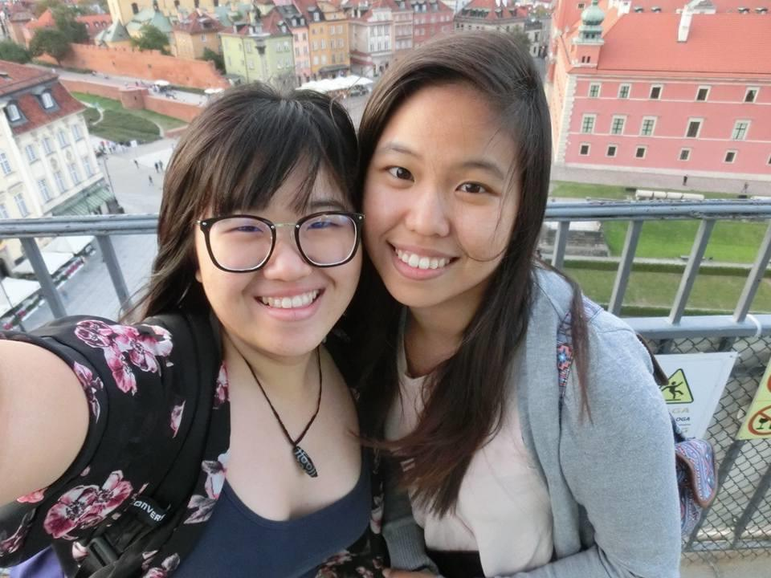
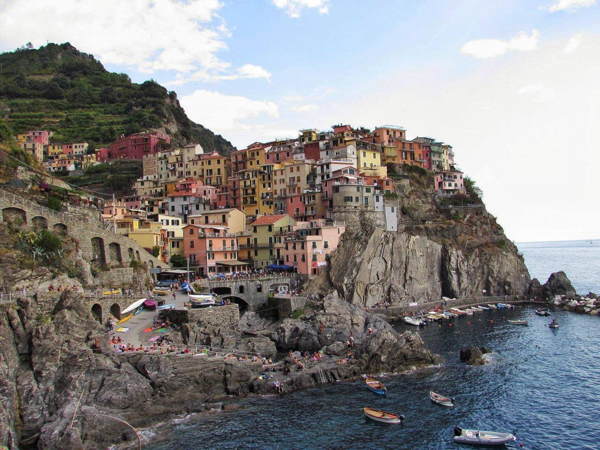
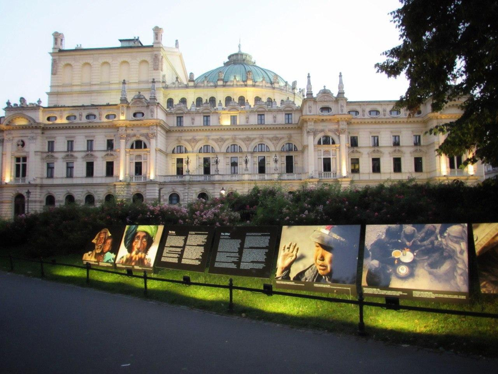
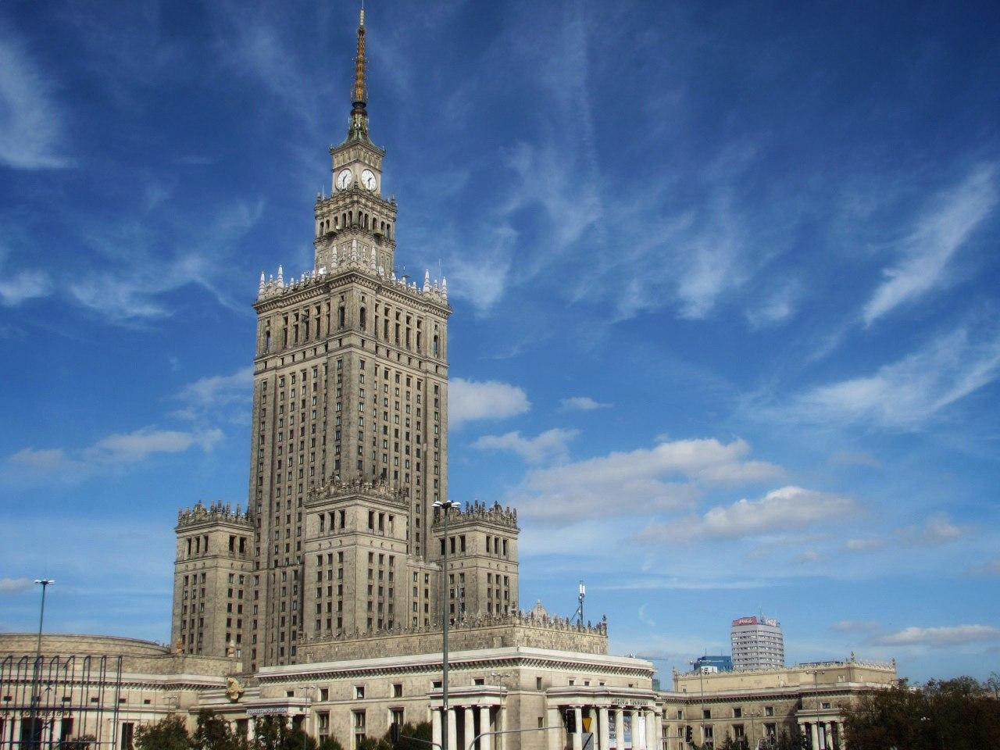
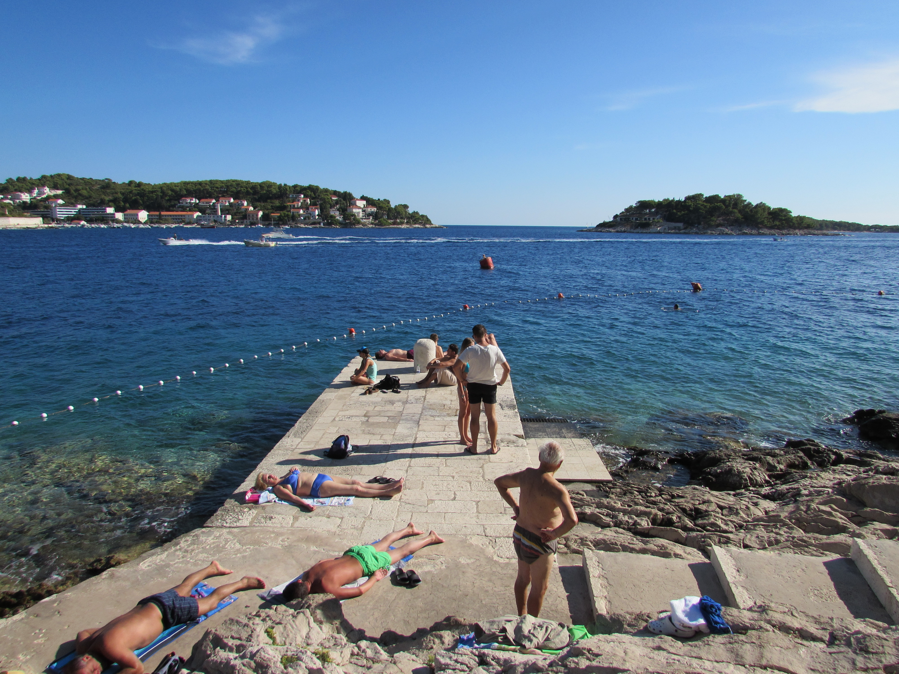

*Photo by [Amy Burry](https://www.instagram.com/amytheglobetrotter/) from Pexels*

In 2016, I invited my sister over to join me on a Europe tour. I was residing in London at the time. 

  

*Disclaimer: this trip is entirely funded by me. No parents’ money involved. Title indicates USD value. In Ringgit terms it is under RM8,000.*

---

In 3 weeks time, we covered 5 countries (UK, Italy, Vatican City, Poland and Croatia) and about 10 cities. The best part? We did it for under RM7,600 per person (Cost includes flying from Malaysia). 

We didn't exactly starve. We stayed at Airbnbs instead of hostels. I think what we did right in keeping it at a decent cost were planning ahead and choosing to alternate between cheap and expensive countries.

For example, Poland is considered a "cheap" country, with its currency złoty almost on par with Malaysia (1:1). UK, Italy and Croatia are considered the more expensive countries, but as I was almost local in London, I knew how to get around cheaply. 

As this is not a travel blog, read on to check out my itinerary and budget! 

## **Itinerary & Transport**
| Date      | Itinerary                                      | Time  | Transport | Code      | Provider           | Cost  | Currency | Total Cost (RM) | Cost Per Person (RM) |
| --------- | ---------------------------------------------- | ----- | --------- | --------- | ------------------ | ----- | -------- | --------------- | -------------------- |
| 7/9/2016  | Kuala Lumpur - Dubai - London Heathrow         | 18h   | Flight    |           | Emirates           | 524.3 | GBP      | 2883.5          | 2883.5               |
| 8/9/2016  | London Liverpool Street - London Stansted      | 47m   | Train     |           | Stansted Express   | 32.0  | GBP      | 176.0           | 88.0                 |
|           | London Stansted - Rome Ciampino                | 2h30m | Flight    | STN - CIA | RyanAir            | 40.8  | GBP      | 224.3           | 112.1                |
|           | Aeroporto Ciampino - Rome Termini              | 40m   | Bus       |           | Terravision        | 8.0   | EUR      | 40.0            | 20.0                 |
| 10/9/2016 | Roma Termini - Firenze S.M.Novella             | 1h31m | Train     |           | Frecciarossa       | 39.8  | EUR      | 199.0           | 99.5                 |
|           | Firenze S.M. Novella - Pisa Centrale           | 1h    | Train     |           | Regionale          | 16.8  | EUR      | 84.0            | 42.0                 |
| 11/9/2016 | Pisa Centrale - La Spezia Centrale             | 1h15m | Train     |           | Regionale          | 15.0  | EUR      | 75.0            | 37.5                 |
|           | La Spezia Centrale - Cinque Terre              | 15m   | Train     |           |                    | 10.0  | EUR      | 50.0            | 25.0                 |
|           | La Spezia Centrale - Genova Piazza Principle   | 1h18m | Train     |           | Frecciabianca      | 19.8  | EUR      | 99.0            | 49.5                 |
| 12/9/2016 | Genova Pizza Principle - Milano Centrale       | 1h45m | Train     |           | Intercity          | 19.8  | EUR      | 99.0            | 49.5                 |
| 13/9/2016 | Milano Centrale - Milan Malpensa               | 51m   | Train     |           | Regionale          | 24.0  | EUR      | 120.0           | 60.0                 |
|           | Milan Malpensa - Kraków John Paul II           | 1h55m | Flight    | MXP - KRK | easyJet            | 41.2  | GBP      | 226.7           | 113.4                |
|           | KRAKÓW LOTNISKO - KRAKÓW GŁÓWNY                | 18m   | Train     |           | KOLEO              | 16.0  | PLN      | 16.8            | 8.4                  |
| 14/9/2016 | Krakow Główny - Auschwitz - Krakow             | 3h    | Bus       |           | LAJKONIK Sp. Jawna | 12.0  | PLN      | 12.6            | 6.3                  |
| 15/9/2016 | Krakow Główny - Ulaznica - Krakow              | 40m   | Train     |           |                    | 5.0   | PLN      | 5.3             | 2.6                  |
| 17/9/2016 | Kraków Główny - Warszawa Centralna             | 3h    | Train     |           |                    | 100.0 | PLN      | 105.0           | 52.5                 |
| 18/9/2016 | Warszawa Centralna - Warszawa Lotnisko Chopina | 20m   | Train     |           |                    | 8.8   | PLN      | 9.2             | 4.6                  |
|           | Warsaw Chopin - Split                          | 1h50m | Flight    | WAW - SPU | Wizz Air           | 86.7  | PLN      | 91.1            | 45.5                 |
|           | Split Airport - Split Main Bus Station         | 30m   | Bus       |           |                    | 60.0  | HRK      | 38.4            | 19.2                 |
| 19/9/2016 | Split - Plitvice Lake - Split                  | 8h    | Bus       |           |                    | 72.0  | EUR      | 360.0           | 180.0                |
| 20/9/2016 | Split - Hvar - Split (Tour)                    | 2h    | Boat      |           |                    | 160.0 | EUR      | 800.0           | 400.0                |
| 21/9/2016 | Split - Dubrovnik                              | 3h    | Bus       |           |                    | 240.0 | HRK      | 153.6           | 76.8                 |
| 23/9/2016 | Dubrovnik Main Bus Station - Dubrovnik Airport | 40m   | Bus       |           |                    | 80.0  | HRK      | 51.2            | 25.6                 |
|           | Dubrovnik - London Gatwick                     | 2h50m | Flight    | DBV - LGW | easyJet            | 199.1 | GBP      | 1095.2          | 547.6                |
|           | London Gatwick - Victoria Bus Station          | 1h    | Bus       |           | National Express   | 20.0  | GBP      | 110.0           | 55.0                 |
| 30/9/2016 | London Heathrow - Dubai - Kuala Lumpur         | 18h   | Flight    | LHR - KUL | Emirates           |       |          |                 |                      |
|           |                                                |       |           |           |                    |       | Total    | 7124.8          | 5004.1               |

## **Accommodation**

| Date      | City      | Cost | Currency | Total Cost (RM) | Cost Per Person (RM) |
| --------- | --------- | ---- | -------- | --------------- | -------------------- |
| 8/9/2016  | Rome      | 80   | GBP      | 440             | 220.0                  |
| 10/9/2016 | Pisa      | 36   | GBP      | 198             | 99.0                   |
| 11/9/2016 | Genoa     | 39   | GBP      | 214.5           | 107.3               |
| 12/9/2016 | Milan     | 43   | GBP      | 236.5           | 118.3               |
| 13/9/2016 | Krakow    | 94   | GBP      | 517             | 258.5                |
| 17/9/2016 | Warsaw    | 15   | GBP      | 82.5            | 41.3                |
| 18/9/2020 | Split     | 75   | GBP      | 412.5           | 206.3               |
| 21/9/2020 | Dubrovnik | 60   | GBP      | 330             | 165.0                  |
|           |           |      |          | Total           | 1215.5               |
## **Total Cost**
| Category       | Cost (RM) | %   |
| -------------- | --------- | --- |
| Transportation | 5004.1    | 66% |
| Accommodation  | 1215.5    | 16% |
| Food & Tour    | 1375      | 18% |
| Total          | 7594.6    |

## **Rough Food Cost By Country**
| Country | Currency | Low Range | Mid Range |
| ------- | -------- | --------- | --------- |
| UK      | GBP      | 5-10      | 15-20     |
| Italy   | EUR      | 5-10      | 15-20     |
| Poland  | PLN      | 15-20     | 30-40     |
| Croatia | EUR      | 5-10      | 10-20     |

**Please note that this is what you can get from a restaurant or a bakery. It is not your "buy a loaf of bread" or "cook yourself" budget. You can get cheaper food by going about that way.* 

This is definitely not the cheapest Europe trip. You can cut the cost lower by:

1. Wait for a deal for the leg between Malaysia and Europe
2. Not be picky about where you go - literally just use Skyscanner and pick a place  
3. Go for couchsurfing
4. Stay at train stations (Do check if the law is against it and watch out for your own safety!)
5. Stay at hostels (They also usually have amazing locations! To save more money, I usually opted for mixed dorm instead of single-sex oops) 
6. Book your transport as early as possible (Especially the trains)
7. Cook yourself
8. Eat bread / Instant Noodle (well... if you don't live to eat. I love my food so I don't mind spending money on it!)
9. Visit cheaper countries (Non-Euro, non-touristic locations... yet) — That means no Spain, Iceland, France, Scandinavian countries, etc. I have been to the mainstream ones, as well as the non-mainstream ones like the Baltic (Lithuania, Latvia and Estonia), and almost always, I prefer the non-mainstream ones. 
10. Avoid the peak seasons, i.e. June-August, and December (Occasionally you get a deal outside of Christmas/ NYE) 

Throwing in some pictures as well! All taken by me :D

  

*One of the 5 towns of Cinque Terre*

  

*My favorite Italian city would be Florence, because of the Uffizi Gallery. Here is a picture of the Birth of Venus by Botticelli. I got to see it with my two eyes! I also got to have amazing Chinese food after days of pastas and pizzas. LOL.*

*Picture from Wikipedia* 

  

*Krakow is probably my favourite city for this trip!*

  

*To be honest, this is a common feature in ex-Soviet countries. They call it Stalin's Birthday Cake. This is in Warsaw.*

  

*The blue sea is a feature of Croatia's coastal city.*

If you would like to check out my travel photos, check out my travel instagram account: [@xiindiie.s](https://www.instagram.com/xiindiie.s/)

How do I fund my travel while I was a student? Well, it is a topic for another post. :) 

Do follow me on my [Facebook](https://www.facebook.com/Money-Monies-111054590434146/) page, [Instagram](https://instagram.com/moneymoniess), and [Twitter](https://twitter.com/moneymoniess) to stay updated!

If you like my content, do sign up for my newsletter below! I don't spam and I guess I will hardly send one if there's nothing interesting. :)